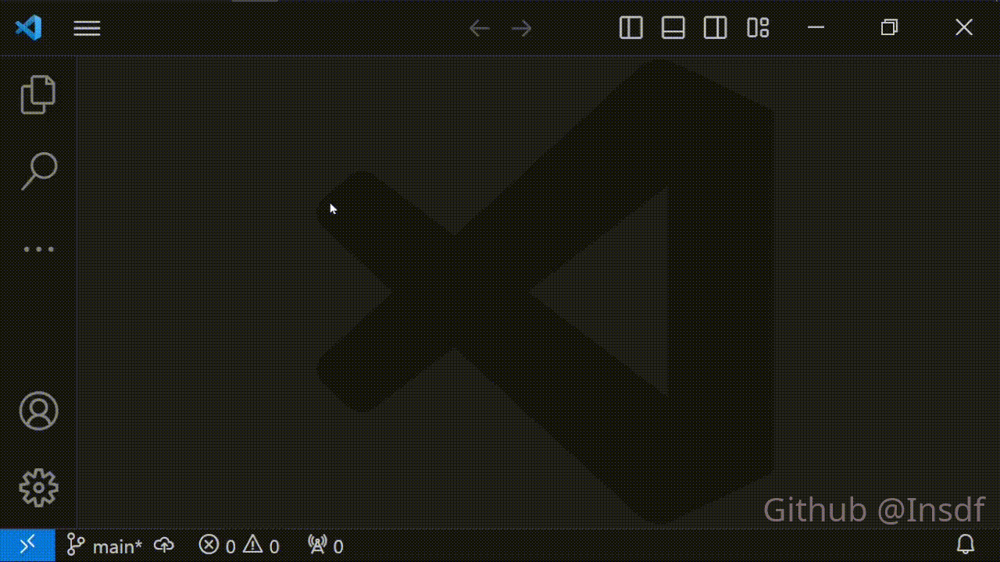

[中文](/README_CN.md)

# Demo



# Explanation of This Project

This project can create C/Cpp file in File--New File prompt. But I think you might modify the source code to create files of many other types.

I create this project because I want to create new cpp file in VSCode, but I set VSCode default language to another more using language. So I want to use File--New File prompt to do this.

However, it seems that VSCode doesn't provide this feature and I search in the extension market, but don't find the desired extension. So I decide to create one by myself.

# Installation and Usage

## Installation

Method 1:

Go to this website:

[C/Cpp New File](https://marketplace.visualstudio.com/items?itemName=Insdf.c-cpp-create-new-file)

Click "Download Extension" in the right of page to download vsix file. Then in VSCode, Click three dots in the left toolbar--Extensions--Click three dots in the topright of poped up column--Install from VSIX.

Method 2:

In VSCode, open Extensions, type `c-cpp-create-new-file` in the search bar and install it.

## Usage

Click menu button--File--New File to choose file type you want to create, as shown in demo gif.

When you save the file at the first time, there will be a prompt to let you input filename and select destination folder. You can delete, e.g. "Untitled-1.h" and just input "example", the file name will be `example.h`

Only after saving can the syntax highlights and snippets work normally. For .h file, you need to associate .h with cpp file format manually.

# To Modify Source Code

## Setup Environment

First, download Node.js:

[Node.js](https://nodejs.org/en)

Make sure that you install npm package manager during Node.js installation.

Then install Typescript:

[TypeScript in Visual Studio Code](https://code.visualstudio.com/Docs/languages/typescript)

Last, install vsce:

[Publishing Extensions](https://code.visualstudio.com/api/working-with-extensions/publishing-extension)

## Start Coding

Git clone or download zip of this project to your computer.

Open terminal from the folder you get, run

`npm install`

Then open src/extension.ts file. Click three dots in the left toolbar--Run and Debug--Click the green button in poped up column.

It will pop up a new VSCode window, and you can try to use the extension feature as mentioned in Usage section.

If you want to add other file type, open `package.json`, modify languages:

```json
"contributes": {
      "languages": [
        {
          "id": "header",
          "aliases": ["Header"],
          "extensions": [
            ".h"
          ]
        }
      ],
      ......
}
```

e.g., .x file extension, after modifying:

```json
"contributes": {
      "languages": [
        {
          "id": "xxx",
          "aliases": ["XXX"],
          "extensions": [
            ".x"
          ]
        }
      ],
      ......
}
```

Then open src/extension.ts, find `export function activate`, and in this function, there are 3 blocks, for example:

```typescript
  context.subscriptions.push(vscode.commands.registerCommand('h.createNewFile', async () => {

    vscode.workspace.openTextDocument({language: "header"}).then((document) => {
        vscode.window.showTextDocument(document);
		});
	}));
``` 

You should copy this block and paste it in the `activate` function.

Then rename the `h.createNewFile` to, `x.createNewFile`, modify language to the `id`(xxx) you just created in `package.json`. It should be like this:

```typescript
  context.subscriptions.push(vscode.commands.registerCommand('x.createNewFile', async () => {

    vscode.workspace.openTextDocument({language: "xxx"}).then((document) => {
        vscode.window.showTextDocument(document);
		});
	}));
``` 

Then you should modify `package.json` in the project root folder to make the new command work and be shown in File--New File.

Add command in `contributes.commands`, note that the value of `command` should be the same as the name you just created in extension.ts:

```json
"contributes": {
    "commands": [
      ......

      {
        "command": "x.createNewFile",
        "title": "XXX: New XXX File",
        "shortTitle":"XXX File"
      }
    ]
}
```

Now you can use Ctrl+Shift+P and type the title to use the new command, in the Run and Debug window. To let the new command be shown in File--New File, modify `contributes.menus.file/newFile`:

```json
"contributes": {    
    ......

    "menus": {
      "file/newFile":[		
        ......

        {
          "command": "x.createNewFile",
          "group": "file@4"
        }
      ]
    }
},
```

Samely, note the value of `command`. And here there is a new property: group.

In VSCode menus, there are many groups such as `navigation`, `2_workspace`, etc. `navigation` group is at the top in the menu by default, other groups sort in the order of 1-9, a-z.

But I read the source code and it seems that in file/newFile there is just one group: file. And it is at the top in File--New File prompt by default. New created group is under the `file` group.

So if you have other extensions providing the File--New File feature, they might use the `file` group as well. And if you want to reorder them, you should download their source codes, modify the group property using @ symbol, e.g. @1 at top.

Last, delete `publisher` in `package.json` or replace it with your publisher name.

After modifying, run terminal from the project  root folder, and run:

`vsce package`

It will create a vsix file. Install it into VSCode and you can use the new extension.

# License

This project uses the [MIT-0](/LICENSE) license, licenses for third-party dependencies are in this file: [NOTICE](/NOTICE).