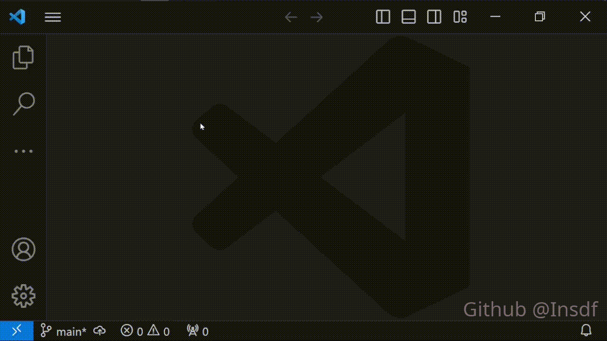

# 演示



# 项目说明

该项目可以在File--New File提示中创建C/Cpp文件。但你可以修改源代码以创建许多其他类型的文件。

我创建这个项目是因为我想在 VSCode 中创建新的 cpp 文件，但我将 VSCode 默认语言设置为另一种更常用的语言。所以我想使用File--New File提示来执行此操作。

但是，VSCode 似乎不提供此功能，在扩展市场中搜索了一下，也没有找到所需的扩展。所以决定自己写一个。

# 安装和使用

## 安装

方法一：

转到此网站：

[C/Cpp New File](https://marketplace.visualstudio.com/items?itemName=Insdf.c-cpp-create-new-file)

单击页面右侧的“Download Extension”以下载vsix文件。然后在 VSCode 中，单击左侧工具栏中的三个点 -- Extensions -- 单击弹出列右上角的三个点 -- Install from VSIX。

方法二：

在 VSCode 中，打开Extensions，在搜索栏中输入`c-cpp-create-new-file`并安装它。

## 用法

单击菜单按钮--File--New File来选择要创建的文件类型，如演示gif所示。

首次保存文件时，会提示你输入文件名并选择目标文件夹。你可以删除，例如“Untitled-1.h”，只需输入“example”，文件名将为“example.h”

只有保存后，语法高亮和snippets才能正常工作。对于 .h 文件，你需要手动将 .h 与 cpp 文件格式相关联。

# 修改源代码

## 设置环境

首先下载Node.js：

[Node.js](https://nodejs.org/en)

确保在 Node.js 安装期间安装 npm 包管理器。

然后安装 Typescript：

[TypeScript in Visual Studio Code](https://code.visualstudio.com/Docs/languages/typescript)

最后安装 vsce：

[Publishing Extensions](https://code.visualstudio.com/api/working-with-extensions/publishing-extension)

## 开始编程

Git clone或下载此项目的 zip 到你的计算机。

从你获得的文件夹中打开终端，运行

`npm install`

然后打开 src/extension.ts 文件。单击左侧工具栏中的三个点--Run and Debug--单击弹出列中的绿色按钮。

它将弹出一个新的VSCode窗口，然后你可以尝试使用“用法”部分中提到的扩展功能。

如果要添加其他文件类型，请打开`package.json`，修改languages:

```json
"contributes": {
      "languages": [
        {
          "id": "header",
          "aliases": ["Header"],
          "extensions": [
            ".h"
          ]
        }
      ],
      ......
}
```

比如 .x 文件扩展，修改后:

```json
"contributes": {
      "languages": [
        {
          "id": "xxx",
          "aliases": ["XXX"],
          "extensions": [
            ".x"
          ]
        }
      ],
      ......
}
```

然后打开src/extension.ts，找到`export function activate`，在此函数中，有 3 个模块，例如：

```typescript
  context.subscriptions.push(vscode.commands.registerCommand('h.createNewFile', async () => {

    vscode.workspace.openTextDocument({language: "header"}).then((document) => {
        vscode.window.showTextDocument(document);
		});
	}));
``` 

应复制此模块并将其粘贴到`activate`函数中。

然后将`h.createNewFile`重命名为`x.createNewFile`，将language修改为刚刚在“package.json”中创建的“id”（xxx）。它应该是这样的：

```typescript
  context.subscriptions.push(vscode.commands.registerCommand('x.createNewFile', async () => {

    vscode.workspace.openTextDocument({language: "xxx"}).then((document) => {
        vscode.window.showTextDocument(document);
		});
	}));
``` 

然后你应该修改项目根文件夹中的`package.json`，使新命令工作并显示在File--New File中。

在`contributes.command`中添加命令，请注意`command`的值应该与你刚刚在extension.ts中创建的名称相同：

```json
"contributes": {
    "commands": [
      ......

      {
        "command": "x.createNewFile",
        "title": "XXX: New XXX File",
        "shortTitle":"XXX File"
      }
    ]
}
```

现在，你可以在“Run and Debug”窗口中使用 Ctrl+Shift+P 并输入title以使用新命令。要让新命令显示在 File--New File 中，请修改 `contributes.menus.file/newFile`：

```json
"contributes": {    
    ......

    "menus": {
      "file/newFile":[		
        ......

        {
          "command": "x.createNewFile",
          "group": "file@4"
        }
      ]
    }
},
```

同样，请注意`command`的值。这里有一个新属性：group。

在VSCode菜单中，有许多group(组)，例如`navigation`，`2_workspace`等，`navigation`组默认位于菜单的顶部，其他组按 1-9，a-z 的顺序排序。

但是阅读了一下源代码，似乎在file/newFile中只有一组：file。默认情况下，它位于“File--New”提示的顶部。新创建的组位于`file`组下。

因此，如果你有其他扩展提供File--New File功能，他们也可能使用`file`组。如果你想对它们重新排序，你应该下载它们的源代码，使用 @ 符号修改 group 属性，例如顶部的 @1。

最后，删除`package.json`中的`publisher`或将其替换为你的publisher名称。

修改后，从项目根文件夹运行终端，然后运行：

`vsce package`

它将创建一个 vsix 文件。将其安装到 VSCode 中，你就可以使用新的扩展。

# 协议

此项目使用 [MIT-0](/LICENSE)协议，第三方依赖项的协议在此文件中：[NOTICE](/NOTICE)。
